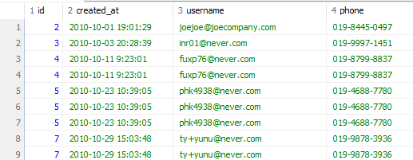

# Data를 Group으로 '묶어서' '계산합시다.'

## 데이터를 계산하는 함수
-Excel에서 합계를 구하고, 평균을 계산하고, 개수를 세는 것과 같은 작업을 하는 것처럼  SQL에서도 동일한 작업이 가능합니다(그리고 비슷하게 생겼습니다). 문자열을 원하는 만큼 잘라내거나, 대/소문자를 변경하는 등의 함수로 나뉩니다. 
1. 집계 함수 : 합 / 평균 / 개수 세기 etc
2. 일반 함수 : 문자열 slicing / 대소문자 변경 etc

### 그룹별로 집계 함수를 적용하기 위해 데이터를 나누는 GROUP BY
-전체 데이터에 함수를 적용하기도 하지만, 그룹별로 수치를 도출하는 경우도 많습니다. 이상의 경우에는 GROUP BY를 이용해 데이터를 그룹으로 묶은 후 필요한 함수를 적용하는 방식을 사용합니다.
- '국가별 회원 수를 집계해라.'
- '일별 매출을 계산해라'.
등의 그룹화 기준을 지정하여 계산을 수행.
### GROUP BY로 계산한 결과를 다시 필터링하는 HAVING
- GROUP BY는 말그대로 그룹화하는 경우를 말합니다. 이상에서 언급한 '국가별 회원 수를 집계'하는 것까지만 가능합니다. 하지만 거기에 더해서 '국가별 회원 수를 계산하고, 회원 수가 10명 이상인 국가만 추출'하는 등의 추가적인 조건을 걸기 위해서는 _그룹화 이후에 조건을 설정_ 해야합니다. 즉, _집계 함수로 계산한 결과 중에서 조건에 맞는 데이터_를 걸어야합니다.

-이상에서 중요한 것은 WHERE은 table 자체에 걸리는 조건이기 때문에 집계 함수 이전에 사용이 불가능하다는 점입니다. 

### 집계 함수
1. COUNT() - 행(row)의 개수를 계산
2. AVG() - 평균
3. SUM() - 합

-예제
```sql
SELECT COUNT(*) FROM users;
      -모든 행의 개수를 계산해서 보여달라.
SELECT COUNT(country) FROM users;
      -country 컬럼의 데이터의 개수를 계산해서 보여달라.
```
NULL 체크 여부 때문에 저희 기준으로 77이 나와야 하는데 결과값은 76이 되어야 정상입니다.

-COUNT() 함수는 주어진 컬럼의 값이 null이 아닌 행의 개수를 반환
회원 정보 테이블 users에서 존재하는 국가(country)를 세는 SQL문(중복 제외).
```sql
SELECT COUNT(DISTINCT country) from users;
```
- DISTINCT : 중복을 제외한 결과값을 COUNT할 때 사용.

3. 예제 : 제품 정보 테이블 products에서 최저가를 출력(정상 가격 기준으로).
```sql
SELECT MIN(price) from products;
```

4. 예제 : 제품 정보 테이블 products에서 정상 가격 기준으로 최고가를 출력.
```sql
SELECT MAX(price) from products;
```

5. 예제 : products에서 정상 가격의 합계를 출력
```sql
SELECT SUM(price) from products;
```

6. 예제 : products에서 discount_price 기준으로 평균을 출력하시오.
```
SELECT * AVG(discount_price) from products;
```
결과값 : 34.427142857142854
하니까 너무 깁니다. 달러화 기준이니까 소수점 둘째자리만 표기하기 위해 중첩 함수를 사용하겠습니다.
```sql
SELECT ROUND(AVG(discount_price), 2) from products;
```
-ROUND(데이터, 소수점표기자리) : 결과값을 소수점표기자리까지만 나타내도록 반올림하는 함수

7. 예제 : users에서 가입일(day/가입연원일출력) / 가입연월(month/가입연월일출력) / 가입일시(created_at/시간까지 출력) 
```sql
SELECT SUBSTR() AS day, 
  SUBSTR(created_at, 1, 7) AS month, 
  created_at 
  FROM users;
```
- SUBSTR(컬럼명, 시작점, 종료점) : 컬럼명에서의 시작점을 기준으로 종료값까지의 데이터를 잘라내서 return
  -주의 사항 : Java / Python / JS 에서의 index 개념과 달리 1부터 시작하며, 종료점이 미만이 아니라 _이하_에 해당함. 
- 결과적으로 SUBSTR()을 사용하기 위해서는 원본 데이터를 볼 수 있어야 하므로 SELECT created_at FROM users;를 확인 후에 SUBSTR()을 적용해야 할 필요성이 있음.

- LENGTH() : DB에 따라서 LEN()을 쓰기도 합니다.
8. 예제 : users에서 이메일 문자열의 길이 추출
```sql
SELECT LENGTH(username), username FROM users;
```
#### 집계 함수 요약
1. SUM() / 합계 / SUM(컬럼명)
2. AVG() / 평균 / AVG(컬럼명)
3. MIN() / 최소값 / MIN(컬럼명)
4. MAX() / 최대값 / MAX(컬럼명)
5. COUNT() / 개수 / COUNT(컬럼명) 

이상의 5개는 DB 종류가 달라도 거의 동일하긴 한데, 일부 함수는 DB마다 지원 여부가 다릅니다.

#### 일반 함수 요약 : 데이터를 가공하거나 변형
1. ROUND() 
 - 소수점 자리를 지정한 자리수까지 반올림하여 반환 / ROUND(컬럼명, 소수점자리수)
2. SUBSTR()
 - 문자열을 지정한 시작 위치로부터 지정한 문자 개수만큼 가져와 반환 / SUBSTR(컬럼명, 시작점, 문자계수)
3. LENGTH()
 - 문자열의 길이를 반환 / LENGTH(컬럼명)
4. UPPER()
 - 알파벳 문자열을 대문자로 변경하여 반환 / UPPER(컬럼명)
5. LOWER()
 - 알파벳 문자열을 소문자로 변경하여 반환 / LOWER(컬럼명)

- 집계 함수는 여러 행의 데이터를 하나의 결과값_으로 집계하는 반면, 일반 함수는 _한 행의 데이터에 하나의 결과값을 반환_ 한다는 차이점이 있습니다.

- 이상의 차이 때문에 집계 함수는 _SELECT에서만 사용 가능_ 하지만 일반 함수는 SELECT 뿐만 아니라 WHERE절에서도 사용 가능합니다.  ★★★★★★ 중요

## 연습 문제
1. products에서 정상 가격을 모두 더한 값을 구하시오. (소수점 둘째자리까지만 표기할 것)
```sql
SELECT SUM(price) FROM products;
```
2. products에서 id가 30 이하인 제품의 정상 가격의 평균을 구하시오(단, 소수점 둘째자리까지 표기할 것).
```sql
SELECT ROUND(AVG(price), 2) FROM products WHERE id < 31;
``` 
3. users에서 가입일시가 2010-10 부터 2010-12까지인 회원 아이디를 중복 없이 센(COUNT) 값을 출력하시오.
```sql
SELECT COUNT(DISTINCT id) from users WHERE SUBSTR(created_at, 1, 7) BETWEEN '2010-10' AND '2010-12';
```
4. users에서 이메일(username)의 길이가 17자리 이하인 회원 수를 중복 없이 센(COUNT) 값을 출력하시오.
```sql
SELECT COUNT(DISTINCT id) from users WHERE LENGTH(username) < 18; 
```

## GROUP BY
### 어떤 기준으로 묶어서 '계산'할까?
- 집계함수만으로 원하는 결과를 얻을 수 없을 때가 있음. 데이터 전체가 아니라 원하는 기준으로 그룹을 나눠 계산할 일이 있기 때문에. 예를 들어 전체 회원 수가 아닌 국가별 회원 수를 나누어 계산하기도 하며, 월별로 강입한 회원 수를 집계하기도 함.

예제 - users에서 country가 Korea인 회원의 수 출력
```sql
SELECT COUNT(DISTINCT id) AS uniqueUserCnt FROM users WHERE country = 'Korea';
```
이상의 경우에는 한국에 해당하는 숫자만 알 수 있으니까, 미국 따로 일본 따로 브라질 따로 일일이 해야 하는가 하는 문제가 발생합니다.
-즉, 국가별 회원 수를 전부 알고 싶다면 이상의 쿼리에서 country = ''부분을 여러 개 작성해야한다는 결론이 나옴.

실제 환경에서는 더 많은 데이터를 다루는 만큼, WHERE절의 조건을 하나하나 바꾸는 방식은 잘 쓰이지 않음.
이때 도입되는 것이 GROUP BY입니다.

예제 :  users에서 국가별 회원 수를 추출
```sql
SELECT country, COUNT(DISTINCT id) AS uniqueUserCnt from users
  GROUP BY country;
```
GROUP BY는 집계 함수와 함께 사용되며, GROUP BY 기준 컬럼은 SELECT에서 집계 함수를 사용할 때 묶어서 계산을 수행하는 _기준_이 됩니다. 그룹으로 나뉜 결과에 따라 집계 함수가 적용되어 결과를 출력합니다.

즉 이상의 SQL문은 'country'의 데이터들을 기준으로 그룹화하라고 했기 때문에 아르헨티나 / 오스트리아 / 벨기에 ... 등으로 country의 각 값들이 일치하는 것들을 기준으로 집계 함수가 개별적으로 적용되었다고 볼 수 있음.

예제 : users에서 country가 Korea인 회원 중 마케팅 수신 동의한 회원수를 추출하시오. (그냥 WHERE 절 쓰셔도 됩니다)

```sql
SELECT COUNT(DISTINCT id) AS uniqueUserCnt from users WHERE country = 'Korea' and country = 'Korea' and is_marketing_agree = 1;
```
이상의 경우는 두 가지 조건을 동시에 적용하여 필터링하고, 집계 함수로 원하는 지표를 추출했습니다.

-한국 대신 독일에 사는 회원의 마케팅 수신 동의 건수를 확인하려면?
-한국에 살고 있기는 하지만 마케팅 수신 동의를 하지 않은 회원 수를 확인하려면?

당연히 WHERE절에서의 값을 바꿔주는 것도 가능합니다.

하지만 많은 조건을 걸어야 할 때마다 직접 쿼리를 바꾼다면 시간도 많이 들고 데이터가 누락될 수도 있습니다.

GROUP BY를 활용했을 때, 두 가지 조건을 모두 충족하는 쿼리를 좀 더 쉽게 작성할 수 있습니다.

예제 : users에서 country별로 마케팅 수신 동의를 한 회원 수 / 동의하지 않은 회원 수를 동시 추출하겠습니다.

```sql
SELECT country, is_marketing_agree, COUNT(DISTINCT id) as uniqueUserCnt from users
  GROUP BY country, is_marketing_agree
  ORDER BY country;
```
만약에

```sql
SELECT country, is_marketing_agree, COUNT(DISTINCT id) AS uniqueUserCnt FROM users
 	GROUP BY country, is_marketing_agree
 	ORDER BY country, is_marketing_agree DESC;
```
라고 썼더라도 결과값은 동일. 이유: ASC가 default

GROUP BY에 두 개 이상의 기준 컬럼을 추가하면 데이터가 여러 그룹으로 나뉩니다. 결과 화면 상에서 Argentina가 입력된 row가 두 개라는 점에 주목하셔야 합니다.

하나는 Argentina이면서 is_marketing_agree = 1인 row의 개수(회원 수) / 다른 하나는 Argentina이면서 is_marketing_agree = 0인 row의 개수를 뜻합니다.

이번 예시에서는 country로 먼저 그룹화가 이루어졌습니다.
그 다음, is_marketing_agree를 기준으로 두 번째 그룹화가 다시 이루어졌습니다.

-이상으로 알 수 있는 중요한 점은 GROUP BY 다음에 복수의 그룹화 조건을 건다면, 그 순서 역시도 매우 중요하다는 점이 됩니다. -> 지정된 컬럼의 순서에 따라 결과가 달라집니다.

-앞서 등장한 기준으로 한 번 그룹화가 이루어지고, 그 그룹 _내에서_ 그 다음 기준으로 그룹화가 _다시_이루어집니다.

예제 : users에서 국가 내 도시별 회원 수를 추출합니다(국가명은 알파벳순으로 정렬하고, 같은 국가 내에서는 회원 수(userCnt) 기준 내림차순으로 정렬할 것).

```sql
SELECT country, city, COUNT(DISTINCT id) AS UserCnt FROM users
  GROUP BY country, city
  ORDER BY  
  GROUP BY userCnt DESC;          
```

- 차원(dimension) : 분석 시에 지표를 그룹으로 묶는 기준
- 메트릭(metric) : 각 차원에 대한 연산을 수행할 때 적용하는 계산식

이상의 쿼리문에서의 차원은 country / city에 해당하고, metric은 COUNT(DISTINCT id)에 해당합니다.

예제 : users에서 월별 가입 회원수를 추출할겁니다. created_at을 활용하고, 최신순으로 정렬할겁니다.
```sql
SELECT SUBSTR(created_at, 1, 7) AS month, COUNT(DISTINCT id) AS userCnt from users
  GROUP BY SUBSTR(created_at, 1, 7)
  ORDER BY month DESC;
```
도 가능하고,

```sql
SELECT SUBSTR(created_at, 1, 7) AS month, COUNT(DISTINCT id)A AS userCnt from users
  GROUP BY month
  ORDER BY month DESC;
```
도 가능합니다. 함수의 결과값을 기준으로 하는 것도 가능하고, AS를 통해서 새로 이름 지은 컬럼명으로도 가능합니다(DB 따라서 다릅니다).

차원 -> 연월
메트릭 -> 회원수

### GROUP BY 요약
1. GROUP BY는 그룹별로 수치를 계산할 때 사용. 쉼표(,)를 써서 그룹화 기준을 복수로 지정 가능.
 - 두 개 이상의 기준을 지정할 때 컬럼 순서에 따라 그룹의 층위가 정해지므로 순서를 명확하게 지정해야 함.

* 참조 : GROUP BY를 쓸 때에는 GROUP BY에 적은 컬럼을 기준으로 SELECT에도 동일한 순서로 적어 계산된 수치의 기준을 알려주면 시인성이 좀 더 좋습니다.
예를 들어 국가 내 도시별 회원수를 구했는데, 회원 수 컬럼만 출력하면 각 숫자가 어느 국가가, 어느 도시의 회원 수인지 알 수 없으므로, 국가와 도시 컬럼도 명확하게 써주는겁니다.

```sql
SELECT COUNT(id) AS userCnt from users GROUP BY country, city;
```
라고 가정하면 컬럼 하나짜리 테이블이 출력될겁니다. 그럼 그냥 1, 2, 5, 76, ...로 숫자들이 있는 상황이 될테니까 쿼리를 직접 읽어보지 않은 이상 이게 어느 국가의 어느 도시의 회원 수인지 알지 못하겠네요.

```sql
SELECT 컬럼1, 컬럼2, ...
  GROUP BY 컬럼1, 컬럼2, ...
```
그래서 이상의 정리본을 도입하면
```sql
SELECT country, city, COUNT(id) AS userCnt from users GROUP BY country, city; 
```
와 같이 써주면 좋다는 의미가 되겠습니다.

* 참조 2 : 그리고 기존에 있는 컬럼들을 먼저 써주고, 그것에 대한 연산을 뒤에 써주게 된다면, 차원 / 매트릭이 서로 분리가 되겠죠.
  차원1, 차원2, 연산1, 연산2 같은 순서로요. 실무적으로 봤을 때 데이터 영역이 나뉘기 때문에 좀 더 시인성이 좋습니다.

연습 문제
1. orderdetails에서 주문 아이디 별 주문 수량의 총합을 출력할 것(주문 수량의 총합이 내림 차순으로)
```sql
SELECT order_id, SUM(quantity) AS sumQuantity
  FROM orderdetails 
  GROUP BY order_id 
  ORDER BY sumQuantity DESC;
```
2. orders에서 직원 아이디 별, 회원 아이디 별로 주문 건수를 출력할 것(단, 직원 아이디 기준 오름 차순으로 먼저 정렬한 뒤, 주문 건수 기준 내림 차순으로 정렬할 것).
```sql
SELECT SUBSTR(order_date, 1, 7) AS month, COUNT(DISTINCT user_id) AS userCnt 
  FROM orders 
  GROup BY month 
  ORDER BY month DESC; 
```
3. orders에서 월별로 주문한 회원 수를 출력할 것(주문일자(order_date) 컬럼을 활용하고, 최신 순으로 정렬할 것).
```sql
SELECT SUBSTR(order_date, 1, 7) AS month, COUNT(DISTINCT user_id) AS userCnt 
  FROM orders 
  GROup BY month 
  ORDER BY month DESC;
```

## HAVING
- 집계 값을 다시 필터링하는 HAVING
-D 이전까지의 수업에서 GROUP BY를 이용하여 데이터를 그룹화하고, 해당 그룹별로 집계 함수를 사용하여 연산을 수행했습니다. 이 방법으로 국가별 회원 수를 추출하는 작업을 수행했습니다.

-그렇다면 여기서 추가적으로 국가별 회원 수가 n명 이상인 국가의 회원 수만 보기 위해서는,
 1. 먼저 집계 함수를 도입하기 위해 SELECT 절에는 집계 함수를 사용할 것이고, 
 2. 조건이 아니라 GROUPING을 진행해야 할겁니다.
 3. 그리고 GROUPING의 결과값에 조건을 걸 필요가 있습니다.
 
 예제 : users에서 country가 Korea / USA / France인 회원 수를 국가별로 출력하시오.

 ```sql
SELECT country, COUNT(DISTINCT id) AS userCnt
  FROM users
  WHERE country IN ('Korea', 'USA', 'France')
  GROUP BY country;
```
France = 9 / Korea = 8 / USA = 11 이라는 결과값이 나옵니다.

3개국에 해당하는 국가의 회원 수 말고, 회원 수가 8명 이상인 국가의 회원 수를 미리 확인하지 않고 바로 SQL 문으로 해결하는 방법을 기준으로 하겠습니다.

SELECT country, COUNT(DISTINCT id) as userCnt FROM users WHERE COUNT(DISTINCT id) > 7 GROUP BY country;
 
일단 일반적으로 생각할 수 있는 방식이 WHERE이 조건절이니까 집계함수의 결과값이 7 초과면 되지 않을까, 라고 생각하셨다면 현재까지 잘 배운 상태라고 할 수 있을겁니다.

그런데 집계 함수는 어디에만 쓸 수 있었다? -> SELECT 절에. 그래서 invalid use of function이라는 alert이 떴습니다.

근데 또 짜증나게 HAVING에서는 집계함수 결과값이 사용 가능합니다.

그래서 정답은

```sql
SELECT country, COUNT(DISTINCT id) AS userCnt 
  FROM users 
  GROUP BY country
  HAVING COUNT(DISTINCT id) > 7
  ORDER BY 2 DESC; 

# 가능
``` 

WHERE 절에서 필터링 할 때 에러가 난 이유 : 
  - 실행하는 쿼리의 순서와 관계있습니다.
  - WHERE의 경우 GROUP BY보다 먼저 실행되며, 컴퓨터가 그룹화를 하기 이전에 조건을 검토하는데, 집계함수로 계산된 값은 GROUP BY 실행 후에 계산되기 때문에 순서상의 오류도 나옵니다.

  - 정확한 순서에 관련한 부분은 HAVING 전체 정리 부분에서 도입하겠습니다(밥먹고 하겠습니다).

  예제 : orders에서 담당 직원별(staff_id) 주문 건수와 주문 회원 수를 계산하고, 주문 건수가 10건 이상'이면서'주문 회원 수가 40명 이하인 데이터만 출력하시오. (단, 주문 건수 기준으로 내림차순 정렬할 것. 
  staff_id / user_id / id 컬럼을 활용할 것)
```sql
SELECT staff_id, COUNT(id) AS orderCnt, COUNT(DISTINCT user_id) AS userCnt
  FROM orders
  GROUP BY staff_id
  HAVING orderCnt > 9 AND userCnt < 41
  ORDER BY orderCnt DESC;
```
직원 아이디별로 담당 주문 건수와 주문한 회원 수가 결과값으로 출력되었는데, 주문 건수는 10건 이상/ 회원 수는 40명 이하인 row만 표시됐습니다. HAVING에서는 WHERE과 마찬가지로 AND / OR 연산자를 사용하여 다수의 조건을 병렬 위치 시킬 수 있습니다.

### HAVING 요약
- HAVING은 'GROUP BY'와 '집계 함수'를 이용해서 그룹별로 집계한 값을 필터링할 때 사용. 
1. HAVING은 WHERE처럼 필터링 기능을 수행하지만, 적용 영역이 서로 다르다. _WHERE은 FROM에서 불러온 데이터를 직접 필터링_ 하지만 HAVING은 _GROUP BY가 실행된 이후의 집계 함수 값을 필터링_한다. 따라서
HAVING은 GROUP BY가 SELECT 문 내에 없다면 사용 자체가 불가능하다.

2. HAVING은 조건 연산자로 여러 조건문을 연결할 수 있으며, 연산이 적용되지 않은 기본 컬럼은 HAVING 에서 사용할 수 없다.

3. 쿼리문의 실행 순서
```sql
SELECT          # 5
  FROM          # 1
  WHERE         # 2
  GROUP BY      # 3
  HAVING        # 4
  ORDER BY      # 6
```
1. FROM을 읽어서 해당 테이블이 존재하는지, 존재한다면 그 테이블을 확인하는 작업을 실행
2. WHERE 절을 실행하여 가져올 데이터의 범위를 확인
3. GROUP BY를 통해서 DB에서 가져올 범위가 결정된 데이터에 대해 집계 연산을 적용할 수 있도록 데이터를 분할함.
4. HAVING을 통해 직전의 단계에서 그룹화 되어진 데이터(집계연산이후)를 가지고 조건을 적용하여 데이터를 필터링함.
5. SELECT가 실행되면서 필터링 범위가 그룹이 정해진 데이터에서 어떤 컬럼을 가지고 올지, 어떤 연산을 적용하여 값을 생성할지 결정.
6. ORDER BY를 통해 제시 / 생성된 컬럼을 기준으로 어떤 방식으로 데이터를 나열할 지 결정.

연습 문제
1. orders에서 회원별 주문 건수를 추출할 것(단 주문 건수가 7건 이상인 회원의 정보만 추출하고, 주문 건수 기준으로 내림차순 정렬할 것. user_id와 id컬럼 활용하시오)
```sql
SELECT user_id, COUNT(id) AS orderCnt
  FROM orders
  GROUP BY user_id
  HAVING orderCnt > 6 
  ORDER BY orderCnt DESC;
```
2. users에서 국가별 도시 수와 국가별 회원(id)수를 추출하시오. (단, 도시 수가 5개 이상이고 회원 수가 3명 이상인 정보만 추출하고, 도시 수, 회원 수 기준으로 모두 내림차순 정렬할 것)
```sql
SELECT country, COUNT(DISTINCT city) AS cityCnt, COUNT(id) AS userCnt
  FROM users
  GROUP BY country
  HAVING cityCnt > 4 AND userCnt > 2
  ORDER BY cityCnt DESC, userCnt DESC;  
```
3. users에서 이하의 국가(country)에 거주중인 회원(id)수를 국가별로 추출할 것(단, 회원 수가 5명 이상인 국가만 추출하고, 회원 수 기준으로 내림 차순 정렬할 것.)
USA / Brazil / Korea / Argentina / Mexico
```sql
SELECT country COUNT(id) AS userCnt
FROM users
WHERE country IN ('USA', 'Brazil', 'Korea', 'Argentina', 'Mexico') 
GROUP BY country
HAVING userCnt > 4 
ORDER BY userCnt DESC;
```

# 여러 가지 데이터를 원하는대로 합치는 JOIN / UNION
-JOIN : 테이블을 좌우로 결합
-UNION : 테이블을 상하로 결합

SQL에서 데이터를 다루다보면 여러 테이블에 나뉘어있는 데이터를 하나로 모아서 봐야하는 경우가 생깁니다. 즉, 테이블들을 미리 다 찢어놨다는 것을 의미합니다.
특정 정보를 보기 위해서 다양한 테이블을 합치는 과정이 필요한데, 이를 다 분할해둔 이유는 관계형 데이터베이스에서는 데이터의 중복을 피하고 쉽게 관리하기 위해서 데이터를 여러 곳에 나누어 보관합니다.

- 이상의 원칙을 _정규화(Data Norminalization)_ 이라고 합니다. 1-6 정규화까지 있긴 한데 실무에서는 약 3정규화 정도까지만 구현함을 원칙으로 합니다. SQLD나 정처기에서 자주 나옵니다.

## JOIN
주문 정보 테이블인 orders와 직원 정보 테이블 staff를 합친다고 가정해보겠습니다. 두 테이블을 합칠 때에는 공통된 부분이 있어야 합니다.
JOIN은 두 테이블의 컬럼 구성이 달라도 결합이 가능하며, 합친 테이블의 컬럼 수는 늘어납니다._

같은 테이블끼리의 JOIN을 수행하더라도 선택하는 JOIN 유형에 따라 다른 결과값이 나오게 됩니다. 그런데, 뭐가 됐든 결합을 위한 공통 분모인 Key가 존재하고, 이것이 어제 배운 PK / FK 개념에 해당합니다.

##  UNION
얘는 컬럼의 구성이 같은 두 쿼리 결과 집합을 상하로 결합합니다. 그래서 _결과는 결합 전의 컬럼 구성과 같습니다._ 그렇기 때문에 결합 대상인 두 쿼리의 결과 집합은 컬럼 순서와 개수가 같아야 합니다.

## SubQuery
데이터가 저장된 상태 그대로 쿼리를 수행하기도 하지만, 쿼리를 수행한 결과를 값이나 조건으로 하여 다시 쿼리를 수행하는 경우도 있습니다. 즉, 쿼리 속의 쿼리를 사용하는데, 이를 서브쿼리라고 합니다. 그러면 여태까지 저희가 사용했던 SQL문이 다시 조건으로 활용되어 새로운 쿼리에 적용될 수도 있을겁니다.

## JOIN
### 컬럼 목록이 다른 테이블을 좌우로 결합
- 여태까지는 테이블 하나를 기준으로(orders면 orders 하나만) 데이터를 다루는 연습을 했지만, 지금부터는 복수의 테이블에서 필요한 정보들을 취합하여 출력할 예정입니다.

- 국가별로 주문 건수를 알아보고 싶다면 어떡해야할지.
  - 국가 정보는 users 테이블에 있고, 주문 건수는 orders 테이블에 있으므로 users / orders를 동시에 다룰 필요가 있을 겁니다.

- 집합의 결합 조건을 연상하시면 좀 더 편하게 될 수 있는데, 얘가 일단 SQLD의 Key문제가 되는 경우가 많습니다. 

### 예제 실습
회원 정보 테이블 users와 주문 정보 테이블 orders를 하나로 결합하여 출력(단, 주문 정보가 있는 정보만 출력할 것)
```sql
SELECT * 
  FROM users u INNER JOIN orders o ON u.id = o.user_id ORDER BY u.id;
``` 
이상의 쿼리문을 실행했을 때 users 테이블과 orders 테이블의 정보가 모두 출력됩니다. 
FROM까지는 동일해보이는데, users 다음에 앞으로 users 테이블의 특정 정보를 편하게 불러오기 위해 테이블 별칭을 u로 정했다는 부분을 확인할 수 있습니다.
그리고 JOIN 유형을 INNER JOIN으로 선택하고, 합쳐질 테이블인 orders 역시 추후 공통된 부분과의 연산을 위하여 o 라는 별칭을 지정했습니다. 
다음 '주문 정보가 있는 회원의 정보만 출력' 하기 위해 ON 조건으로 두 테이블 간의 교집합을 해주었습니다. 이상의 경우에서 


를 확인하시면 1로 시작되지 않음을 확인했을 때, users 테이블의 id 컬럼의 값이 1인 row는 존재하지만, orders 테이블의 user_id 컬럼에는 1의 값을 지니는 row가 없기 때문에 최종 출력 결과에서 누락되었음을 알 수 있습니다.

FROM 다음에 테이블 명 뒤에 AS 안 붙였는데 왜 테이블 축약어가 지정되냐는 부분이 궁금하실 수도 있는데, AS는 컬럼명 지을 때 쓰는겁니다.

```sql
SELECT * 
  FROM users INNER JOIN orders ON users.id = orders.user_id
  ORDER BY users.id;
```
축약어를 안정해도 무방합니다. 근데 선호되는 작성 방식은 아닙니다.

그러면 축약어 정했다고 했을 때 u.id는 마치 객체명.필드명 처럼 우리가 값을 확인할 수 있겠네요.
정리하자면, 두 테이블을 하나로 결합하려면 두 테이블에 공통된 부분이 존재해야 함.
관계형 데이터베이스에서는 이 부분을 키(key)라고 합니다. 그래서 관계형 데이터베이스에서는 키 값이 테이블에 반드시 한 개 이상 존재하도록 설계되어 있고, 테이블에서 개별 행을 '유일하게 구분'짓습니다. (id의 정의죠). 따라서 _키 값은 컬럼 내에서 중복되지 않으며 다른 개별 행을 구분해야 하므로 null값을 가질 수도 없습니다_

-참조 : 키 값은 테이블 내에서 고유한 값을 가지므로 한 테이블에서 개수를 계산할 때 중복되지 않습니다. 그런데 여러 테이블을 조인하면 키 값도 중복될 수 있습니다. 예를 들어서 회원 아이디가 7인 사람이 세 번 주문햇다면, 회원 정보와 주문 정보를 결합한(JOIN의 결과값) 테이블에서는 회원 아이디가 7인 row가 3개 있을겁니다. 이때 '한 번이라도 주문한 회원 수'를 중복없이 구하려면 결국에는 DISTINCT 요구될겁니다.
`COUNT(DISTINCT u.id)`의 형태로 작성해야겠네요.

users에 있는 id는 PK에 해당
orders에 있는 user_id는 FK에 해당
즉, PK와 FK의 결합을 통해서 JOIN이 이루어진다. 고 볼 수 있죠.

그러면 논리적으로, FK는 중복이 가능한가요 불가능한가요? => 중복 가능함.

### INNER JOIN 
- 두 테이블의 키 값이 _일치하는 행만_ 가져오는 JOIN. -> 집합의 개념으로 보자면 _교집합_에 해당합니다.

- u.id가 1인 정보가 o.user_id에 없었기 때문에 누락되었습니다.

### LEFT JOIN 
예제 : users와 orders를 하나로 결합하여 출력할 것(주문 정보가 _없는_ 회원의 정보도 출력할 것)
```
OUTER는 생략 가능
```sql
SELECT * 
  FROM users u 
    LEFT OUTER JOIN orders o 
    ON u.id = o.user_id 
  ORDER BY u.id;
```  
INNER JOIN과 유사하게 테이블 두 개가 합쳐지기는 했습니다. INNER JOIN이 두 개의 집합에서의 교집합 부분만 추출하는 반면에, LEFT JOIN의 경우는 먼저 언급된(users) 테이블의 전체 정보는 전부 다 출력하고, 그 중에서 orders 테이블과 일치하는 것들만 따로 더 가지고 오는 형태라고 할 수 있습니다.

얘네 두 개가 실무에서 제일 자주 쓰입니다. 데이터를 결합하는 경우 대부분 한쪽 테이블의 값을 보전해야 하는 경우가 많은데, LEFT (OUTER) JOIN이 이에 해당합니다.

하지만 주문 내역만 명확하게 보고 싶다면 INNER JOIN을 쓰겠죠.

형식 : 
`FROM 테이블1 a (LEFT/INNER) JOIN 테이블2 b ON a.PK = b.FK;`
LEFT : 왼쪽 테이블의 키 값이 오른쪽 테이블의 키 값과 _매칭되지 않는 행도_ 가지고 오는데, 왼쪽 테이블의 컬럼 값은 전부 다 출력하고, 오른쪽 테이블 컬럼 값은 null로 표기됨.
INNER : 오른쪽 왼쪽 테이블에서 전부 정보 조회가 되는 값들만 출력함.

```sql
SELECT u.id, u.created_at, u.username, o.id, o.order_date, o.staff_id * FROM users u LEFT JOIN orders o ON u.id = o.user_id ORDER BY u.id;
```

예제 : users와 orders를 하나로 합치는데, 주문 정보가 없는 회원의 정보만 출력할 것

```sql
SELECT * FROM users u LEFT JOIN orders o ON u.id = o.user_id ORDER BY u.id;
```
이상의 결과값은 주문정보가 있는/없는 회원이 전부 다 추출됩니다.
여기서 주문 정보가 없는 애들만 걸러야겠네요.
```sql
SELECT * 
  FROM users u
  LEFT JOIN orders o
  ON u.id = o.user_id
  WHERE o.id IS null
  ORDER BY u.id;
``` 
이상에서 처음 배우는 개념 IS입니다. 프로그래밍 언어에서 배웠을 때는 == null 위주로 썼을 때 == 에 해당한다고 보셔도 됩니다.

연습 문제 : 
users와 orders 테이블을 하나로 결합하고, 추가로 orderdetails에 있는 데이터도 출력할 것(단, 주문 정보가 없는 회원의 주문 정보도 전부 출력하고, 다음 컬럼을 출력할 것. 회원 아이디 / 이메일 / 연락처 / 주문 아이디 / 제품 아이디) 

```sql
SELECT * 
  FROM 테이블1 a 어쩌고 JOIN 테이블2 B ON a.PK = b.FK
  어쩌고 JOIN 테이블3 c ON a/b.PK = C.FK;
```  
2중 JOIN을 수행하게 됩니다. a와 b의 테이블을 결합했을 경우 하나의 테이블이 생겼고, 이를 기준으로 다시 c와 JOIN을 수행하는 거기 때문에 굳이 따지자면 (1+1) + 1의 JOIN이라고 볼 수 있습니다.
```sql
SELECT u.id, u.username, u.phone, o.id, od.product_id
  FROM users u LEFT JOIN orders o ON u.id = o.user_id
  INNER JOIN orderdetails od ON o.id = od.order_id
  ORDER BY u.id;
```
이상에서 중요한 것은 기본적으로 SELECT * FROM users / orders / orderdetails를 수행해서
특정 테이블의 어느 컬럼이 다른 테이블의 컬럼과 일치하는지 여부를 찾는 일이 되겠습니다,
users 테이블은 기준이 됩니다.
그리고 orders 테이블에는 user_id 컬럼이 있죠.
근데 orderdetails 테이블에는 order_id가 있습니다.
그러면 그 결과 users + orders 테이블 연산을 할 때는 user의 id를 나타내는 u.id와 o.user_id를 공통점으로 JOIN 연산을 수행하고, 그 연산 결과를 기준으로
공통적으로 존재하는 order 테이블의 id를 나타내는 o.id와 od.order_id를 공통점으로 JOIN 연산을 한번 더 수행하는 것이라고 볼 수 있습니다. 

